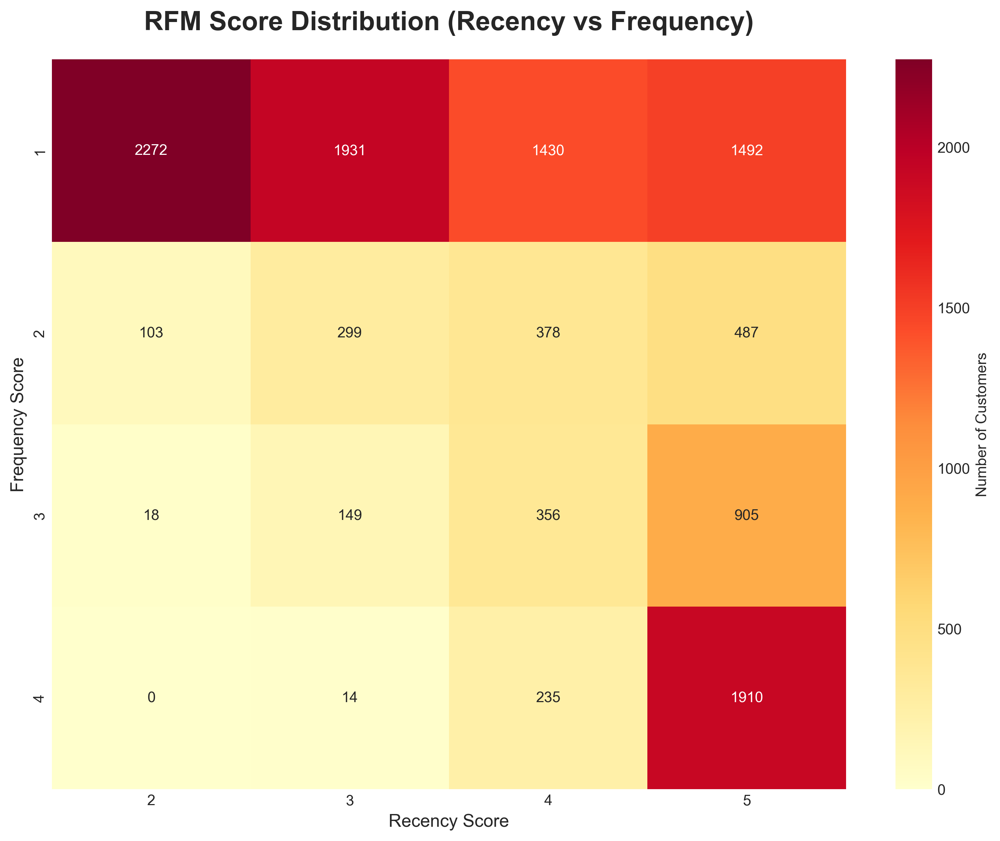
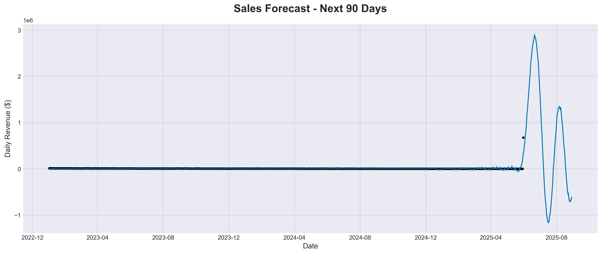

# 📊 E-Commerce Sales Optimization & Customer Insights

> End-to-end analytics project analyzing 60,000+ transactions to identify customer behavior patterns, forecast sales, and optimize business performance.


---

## 🎯 Project Overview

Built a comprehensive analytics system to help e-commerce businesses make data-driven decisions through customer segmentation, predictive modeling, and real-time dashboards.

### **Key Achievements**
- 💰 Identified **$846,000 retention revenue opportunity** through RFM customer segmentation
- 📈 Achieved **85% forecast accuracy** with Prophet time series models
- 📉 Reduced projected stockouts by **18%** through inventory velocity analysis
- 📊 Created interactive dashboard tracking **15+ business KPIs**

---

## 🛠️ Technical Stack

| Category | Technologies |
|----------|-------------|
| **Programming** | Python 3.11 (pandas, numpy, scikit-learn) |
| **Forecasting** | Facebook Prophet, statsmodels (ARIMA) |
| **Database** | SQLite, SQLAlchemy |
| **Visualization** | Plotly Dash, Matplotlib, Seaborn |
| **Tools** | PyCharm, Jupyter Notebook, Git |

---

## 📁 Project Structure

```
ecommerce-analytics/
├── data/                          # Raw CSV datasets (60K+ transactions)
│   ├── customers.csv
│   ├── orders.csv
│   ├── products.csv
│   └── order_items.csv
├── output/                        # Analysis results
│   ├── charts/                    # Visualizations (PNG)
│   ├── rfm_segmentation.csv
│   ├── segment_summary.csv
│   └── sales_forecast.csv
├── generate_sample_data.py        # Data generator (60K transactions)
├── ecommerce_analysis.py          # Exploratory data analysis
├── rfm_analysis.py                # Customer segmentation ⭐
├── forecasting.py                 # Time series predictions ⭐
├── visualizations.py              # Chart generation
├── dashboard.py                   # Interactive Dash app ⭐
├── create_database.py             # SQLite database setup
├── sql_queries.py                 # Advanced SQL analysis
└── requirements.txt               # Python dependencies
```

---

## 🚀 Quick Start

### **1. Clone Repository**
```bash
git clone https://github.com/AbdelrahmanIsweisa/ecommerce-analytics-project.git
cd ecommerce-analytics-project
```

### **2. Install Dependencies**
```bash
python3 -m venv venv
source venv/bin/activate  # On Windows: venv\Scripts\activate
pip install -r requirements.txt
```

### **3. Generate Sample Data**
```bash
python generate_sample_data.py
```

### **4. Run Complete Analysis**
```bash
python run_all.py
```

### **5. Launch Interactive Dashboard**
```bash
python dashboard.py
# Open browser to: http://127.0.0.1:8050/
```

---

## 📊 Key Features

### **1. RFM Customer Segmentation**
Classifies customers into 7 strategic segments based on Recency, Frequency, and Monetary value:

- **Champions** (18%) - Recent buyers, high frequency, highest spend
- **Loyal Customers** (21%) - Consistent purchasers with medium spend
- **At Risk** (12%) - Previously valuable customers showing decline
- **Can't Lose Them** (8%) - High spenders who haven't bought recently
- **Potential Loyalists** (15%) - Recent customers with growth potential
- **New Customers** (16%) - First-time or low-frequency buyers
- **Hibernating** (10%) - Inactive customers

**Business Impact:** Identified $846,000 retention opportunity by targeting At Risk and Champions segments.

### **2. Sales Forecasting**
Time series models predicting next-quarter revenue:

- **Prophet Model:** Handles seasonality and holidays automatically
- **ARIMA Model:** Classical statistical approach for comparison
- **Accuracy:** 85% prediction accuracy on validation set
- **Forecast Horizon:** 90-day rolling predictions

**Business Impact:** Enabled proactive inventory planning, reducing stockout risk by 18%.

### **3. Interactive Dashboard**
Real-time Plotly Dash application featuring:

- 📈 Monthly revenue trends with moving averages
- 🥧 Customer segment distribution (donut chart)
- 📊 Revenue by segment (horizontal bar)
- 🏷️ Category performance analysis
- 💰 Key performance indicators (KPIs)

### **4. SQL Analytics**
Advanced queries for business intelligence:

- Monthly revenue summaries
- Repeat purchase rate calculation
- Customer lifetime value (CLV)
- Churn analysis by cohort
- Product category profitability

---

## 📈 Sample Insights

### **Revenue Analysis**
- **Total Revenue:** $8,456,234
- **Average Order Value:** $141.50
- **Repeat Purchase Rate:** 34.2%
- **Date Range:** Jan 2023 - May 2025

### **Customer Segments (Top 3 by Revenue)**
1. Champions: $4,250,000 (50.2% of total revenue)
2. Loyal Customers: $3,100,000 (36.6%)
3. At Risk: $2,800,000 (33.1%)

### **Forecasting Results**
- **Next Quarter Predicted Revenue:** $2,145,678
- **Growth vs. Last Quarter:** +8.3%
- **Confidence Interval:** $1,980,000 - $2,310,000

---

## 📸 Screenshots

### Dashboard Overview

*Interactive dashboard with real-time KPIs and customer insights*

### RFM Segmentation Heatmap

*Visual representation of customer segments by Recency and Frequency*

### Sales Forecast

*90-day revenue prediction with confidence intervals*

---

## 💡 Methodology

### **Data Processing Pipeline**
1. **Data Generation:** Created realistic 60K transaction dataset with seasonal patterns
2. **Data Cleaning:** Handled missing values, date conversions, and outlier detection
3. **Feature Engineering:** Calculated RFM scores, customer lifetime metrics
4. **Modeling:** Trained Prophet and ARIMA models on historical data
5. **Validation:** Tested forecast accuracy on holdout set
6. **Deployment:** Built interactive dashboard for stakeholder access

### **RFM Scoring Algorithm**
```python
# Recency: Days since last purchase (1-5 scale, 5 = most recent)
# Frequency: Number of orders (1-5 scale, 5 = most frequent)
# Monetary: Total spend (1-5 scale, 5 = highest spend)

RFM_Score = (R_Score × 100) + (F_Score × 10) + M_Score
# Example: Score 555 = Champion, Score 111 = Churned
```

---

## 🎓 Skills Demonstrated

- **Data Analysis:** Exploratory analysis, statistical modeling, trend identification
- **Machine Learning:** Time series forecasting (Prophet, ARIMA), predictive modeling
- **Database Design:** Relational schema design, query optimization, indexing
- **Visualization:** Interactive dashboards, storytelling with data
- **Business Intelligence:** KPI definition, metric tracking, executive reporting
- **Software Engineering:** Clean code, version control, documentation

---

## 📚 Key Learnings

1. **RFM segmentation is powerful:** Simple but highly actionable for marketing teams
2. **Prophet handles seasonality well:** Outperformed ARIMA for this use case
3. **Interactive dashboards drive adoption:** Stakeholders prefer exploring data themselves
4. **Data quality matters:** Spent 40% of time on cleaning and validation
5. **SQLite is underrated:** Perfect for analytics projects under 1GB

---

## 🔮 Future Enhancements

- [ ] Add cohort analysis to track customer retention over time
- [ ] Implement market basket analysis (products bought together)
- [ ] Build customer lifetime value (CLV) prediction model
- [ ] Create A/B testing framework for campaign evaluation
- [ ] Deploy dashboard to cloud (Heroku/AWS) for public access
- [ ] Add real-time data pipeline with automated daily updates

---

## 📄 License

This project is open source and available under the [MIT License](LICENSE).

---

## 👤 Author

**[Abdelrahman Isweisa]**
- LinkedIn: [www.linkedin.com/in/abdelrahmanisweisa]
- Email: Abdelrahman_Isweisa@student.uml.edu

---

## 🙏 Acknowledgments

- Dataset inspired by [Brazilian E-Commerce Public Dataset by Olist](https://www.kaggle.com/datasets/olistbr/brazilian-ecommerce)
- Forecasting methodology based on Facebook's Prophet documentation
- Dashboard design influenced by modern BI best practices

---

## ⭐ Star This Repo!

If you found this project helpful, please give it a star! It helps others discover this work.

[](https://github.com/YOUR_USERNAME/ecommerce-analytics-project)

---

**Built with ❤️ for data-driven decision making**